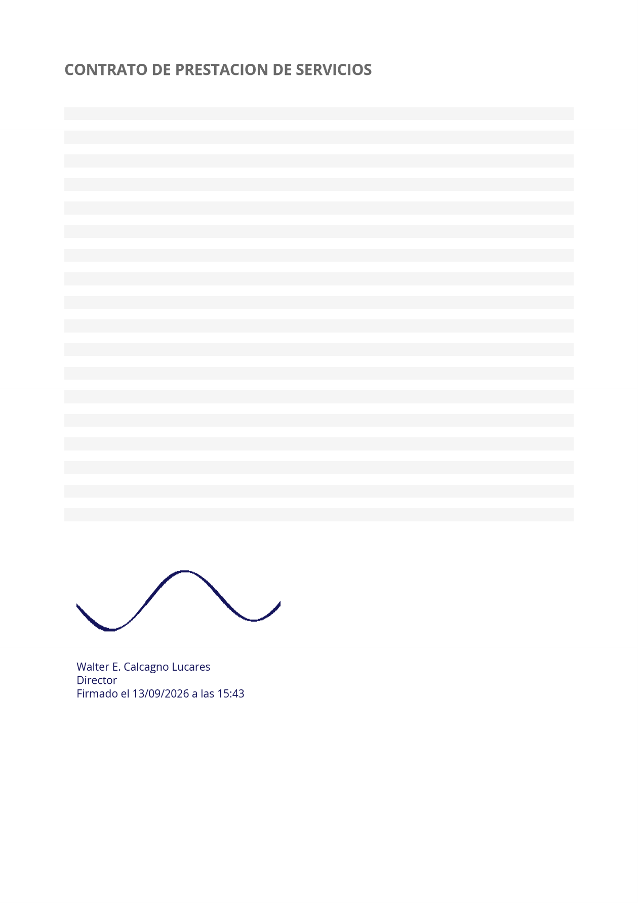

# PdfSigner

[](https://github.com/wcalcagno/pdf_signer/actions/workflows/ci.yml)
[](LICENSE)
[](https://github.com/wcalcagno/pdf_signer/releases/latest)

Aplicación libre y multiplataforma para firmar PDFs: coloca tu imagen de firma y un
bloque de texto donde quieras, y exporta el documento con esa firma **incrustada como
contenido real del PDF**.

Una sola base de código en .NET MAUI para Windows, macOS, iOS y Android.

## Descargar

**[⬇️ Instaladores para Windows, Android y macOS](download/README.md)**

Cada plataforma tiene sus particularidades al instalar software sin firmar; están
explicadas ahí. Para iOS no hay descarga posible, y el motivo también está explicado.

## Qué es y qué no es

Esto es **firma visual**: el equivalente digital de estampar tu firma sobre el papel.
Sirve para lo que sirve un documento firmado a mano y escaneado.

**No es firma criptográfica.** No hay PAdES, ni certificados X.509, ni sellado de tiempo,
y por tanto no prueba matemáticamente quién firmó ni detecta manipulaciones posteriores.
Si necesitas validez legal avanzada, esta no es la herramienta. Está en el
[roadmap](#roadmap), pero es un cambio de alcance mayor.

Lo que sí garantiza:

- El texto queda **seleccionable y buscable**, no dibujado como imagen.
- La imagen se incrusta como objeto del PDF **conservando la transparencia**.
- El contenido original del documento se mantiene intacto.
- El archivo crece unos pocos KB, no varios MB, porque no se rasteriza nada.



*Salida real generada por `PdfSigner.Core`. La firma conserva el canal alfa y las tres
líneas de texto son texto de verdad, seleccionable en cualquier visor.*

## Motivación

Firmar un PDF es una necesidad cotidiana y trivial, pero las herramientas comerciales que
lo hacen bien cuestan suscripciones anuales difíciles de justificar cuando lo único que
quieres es poner tu firma en un contrato dos veces al mes. Las alternativas gratuitas
suelen ser servicios web a los que hay que subir el documento, lo cual no siempre es
aceptable con papeles que contienen datos personales o información de la empresa.

PdfSigner hace ese caso simple, en local, sin cuenta, sin subir nada a ningún sitio y sin
coste. Todo ocurre en tu dispositivo.

## Estado por plataforma

Ser honesto con esto importa más que aparentar madurez. MAUI se comporta de forma desigual
entre plataformas y este proyecto se ha desarrollado en una máquina Windows:

| Plataforma | Estado | Detalle |
|---|---|---|
| **Windows** | ✅ Probado en uso real | Se ha usado de principio a fin sobre documentos reales de varias páginas: abrir, colocar la firma, arrastrarla, redimensionarla por las esquinas, deshacer, guardar favorita, navegar entre páginas y exportar. El instalador se ha instalado, ejecutado y desinstalado sin dejar restos. |
| **Android** | 🟡 Compila | Se genera el APK en CI, pero **nadie lo ha ejecutado en un dispositivo**. |
| **macOS** | 🟡 Compila | Se genera el `.app` en CI, pero **nadie lo ha ejecutado**. |
| **iOS** | ⚠️ Sin compilar | No por el código: el runner de CI no tiene ningún runtime de simulador compatible con el Xcode que exige .NET para iOS 26, y `actool` falla antes de terminar. El mismo rasterizador de CoreGraphics **sí compila** en el trabajo de macOS, que comparte ese archivo. |

Que algo compile no significa que funcione. En Android y macOS está verificado que el
código es válido y que se empaqueta, nada más: la interacción real —abrir un PDF, arrastrar
la firma, exportar— no la ha probado nadie todavía.

**Si lo pruebas en alguna de esas plataformas, un issue contando qué pasó es la
contribución más valiosa que puedes hacer ahora mismo.**

El núcleo de firma (`PdfSigner.Core`) está cubierto por **176 pruebas** que corren en CI sin
emulador ni Mac, y es donde vive toda la lógica que puede producir un PDF incorrecto.

## Arquitectura

Tres proyectos, con una separación que no es decorativa:

```
src/PdfSigner.Core/    Lógica de firma. .NET puro, sin MAUI.
src/PdfSigner.App/     Interfaz MAUI y código específico de cada plataforma.
tests/PdfSigner.Core.Tests/   176 pruebas, corren en CI sin emulador ni Mac.
```

`PdfSigner.Core` **no referencia MAUI**. Gracias a eso, la parte que de verdad puede
romperse —convertir coordenadas de pantalla a coordenadas del PDF— se prueba en segundos
en un runner de Linux, sin emuladores.

### Dos decisiones que conviene conocer antes de tocar el código

**1. Escribir y rasterizar son problemas distintos.**
[PDFsharp](https://www.pdfsharp.net/) (MIT) escribe en el PDF, pero no lo rasteriza; de
hecho ninguna librería .NET libre lo hace de forma portable. En lugar de empaquetar PDFium
—entre 15 y 25 MB por arquitectura, además del
[problema abierto](https://github.com/sungaila/PDFtoImage/issues/141) de rechazo en App
Store porque `libpdfium.dylib` no viaja como framework— cada plataforma usa el motor PDF
que su sistema operativo ya trae:

| Plataforma | Motor | Coste añadido |
|---|---|---|
| Windows | `Windows.Data.Pdf` | 0 bytes |
| Android | `android.graphics.pdf.PdfRenderer` | 0 bytes |
| iOS / macCatalyst | CoreGraphics | 0 bytes |

**2. La rotación de página es la trampa principal.**
PDFsharp **ignora la entrada `/Rotate`**: en una página A4 rotada 90° informa 595×842
cuando el usuario está viendo 842×595. Sin compensarlo, toda firma sobre un escaneado
apaisado sale girada y desplazada, y lo peor es que el PDF se genera sin dar ningún error:
el fallo solo se descubre al abrir el archivo. `PageGeometry` resuelve esto y los tests lo
verifican leyendo las matrices del content stream.

Cuidado también con que los rasterizadores no coinciden entre sí: Windows y Android
devuelven el tamaño ya rotado, mientras que CoreGraphics no. Está documentado en el código.

## Requisitos

- **.NET SDK 10** o superior
- **Workloads de MAUI**: `dotnet workload install maui`

Y además, según la plataforma a la que compiles:

| Objetivo | Necesitas |
|---|---|
| Windows | Windows 10 build 19041 o superior |
| Android | SDK de Android y un JDK 17+ |
| iOS / macCatalyst | Un Mac con Xcode |

Para trabajar **solo en la lógica de firma** basta el SDK de .NET: ni workloads, ni Mac,
ni emuladores.

## Compilar

```bash
dotnet build src/PdfSigner.App/PdfSigner.App.csproj -f net10.0-windows10.0.19041.0
```

```bash
dotnet build src/PdfSigner.App/PdfSigner.App.csproj -f net10.0-android
```

```bash
dotnet build src/PdfSigner.App/PdfSigner.App.csproj -f net10.0-ios
```

```bash
dotnet build src/PdfSigner.App/PdfSigner.App.csproj -f net10.0-maccatalyst
```

Los tests, que no necesitan workloads:

```bash
dotnet test tests/PdfSigner.Core.Tests/PdfSigner.Core.Tests.csproj
```

## Uso

1. **Abrir PDF** y navegar por las páginas con la tira de miniaturas.
2. **Añadir firma** para colocar una imagen PNG o JPG. Arrástrala para moverla y usa
   cualquiera de las **cuatro asas de las esquinas** para cambiar su tamaño: la esquina
   opuesta se queda donde está.
3. **Añadir texto** para un bloque multilínea, con tamaño y una paleta de colores.
4. **Deshacer** (↶) retrocede el último movimiento, cambio de tamaño o borrado.
5. **Exportar**: diálogo de guardado en escritorio, hoja de compartir en móvil.

Al seleccionar un elemento aparecen sus propiedades: en escritorio, en una columna fija a
la derecha; en móvil, en un panel que sube desde abajo. Sobre la página flota además una
barra con las acciones que dependen de lo seleccionado.

Cada firma y cada texto quedan **anclados a la página donde los colocaste**, así que puedes
firmar varias páginas de un mismo documento.

### Marcadores

Se sustituyen en el momento de exportar, no al escribirlos. Es a propósito: una firma
favorita guardada hace meses estampa la fecha del día en que firmas de verdad.

| Marcador | Resultado |
|---|---|
| `{fecha}` | `13/09/2026` |
| `{hora}` | `14:30` |
| `{fechalarga}` | `13 de septiembre de 2026` |

### Firma favorita

**Guardar favorita** memoriza tu imagen y tu bloque de texto en el dispositivo para
reutilizarlos con **Usar favorita**. Se guarda en local, sin backend ni cuenta, y no se
sincroniza entre dispositivos.

## Roadmap

Fuera del alcance de esta versión, por orden aproximado de interés:

- [ ] Firma criptográfica: PAdES y certificados X.509
- [ ] Validación de firmas de terceros
- [ ] Firma en lote de varios PDFs
- [ ] Sincronización de firmas favoritas entre dispositivos
- [ ] Dibujar la firma a mano alzada en pantalla táctil
- [ ] Capturas reales de la aplicación en las cuatro plataformas

## Contribuir

Se agradecen los aportes, y **no hace falta escribir código**: probar en una plataforma sin
verificar y contar qué pasó es ahora mismo lo más útil. Ver [CONTRIBUTING.md](CONTRIBUTING.md).

## Licencia

[MIT](LICENSE) © 2026 Walter E. Calcagno Lucares

Usa [PDFsharp](https://www.pdfsharp.net/) (MIT),
[CommunityToolkit.Mvvm](https://github.com/CommunityToolkit/dotnet) (MIT) y la tipografía
[Open Sans](https://github.com/googlefonts/opensans) (SIL Open Font License 1.1).
